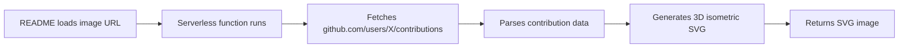

# 🧊 3D GitHub Contributions

<div align="center">

### Display a stunning 3D isometric contribution graph on your GitHub profile.

**No GitHub Actions • No Tokens • No Setup — Just paste one line in your README.**

[🚀 **Live Demo**](https://3d-github-readme-only.vercel.app/?user=torvalds) · [📖 How It Works](#how-it-works) · [⚡ Deploy Your Own](#deploy-your-own)

</div>

---

## 🎯 Quick Start — Add to Your README

**1.** Deploy your own instance (one click):

[](https://vercel.com/new/clone?repository-url=https%3A%2F%2Fgithub.com%2FYOUR_USERNAME%2F3D-github-readme-only)

**2.** Once deployed, add this to your GitHub profile `README.md`:

```markdown

```

**3.** Replace `YOUR-PROJECT` with your Vercel project name and `YOUR_GITHUB_USERNAME` with your GitHub username. Done! ✅

### Example

```markdown

```

---

## ✨ What is this?

Most 3D GitHub contribution visualizers require you to:
- Set up GitHub Actions workflows
- Create personal access tokens
- Configure YAML files in your repo

**This project does none of that.** It's a serverless function that generates a 3D isometric SVG of any public GitHub profile's contributions on the fly. Just use an image URL in your README.

## 🎯 Features

| Feature | Description |
|---------|-------------|
| 🔓 **Zero Setup** | No tokens, no actions, no config files |
| 🧊 **Real 3D** | Isometric projection with proper depth & lighting |
| 🌐 **Any User** | Works for any public GitHub profile |
| ⚡ **Fast** | Pure SVG generation, no headless browser needed |
| 🔄 **Auto-Updates** | Graph refreshes automatically (1-hour cache) |
| 📐 **Scalable** | SVG looks sharp at any size |
| 🎨 **GitHub Colors** | Uses the official GitHub contribution color palette |

## ⚡ Deploy Your Own

### Vercel (Recommended — Free)

1. Click the **Deploy** button above, or:
   - Fork this repository
   - Go to [vercel.com](https://vercel.com) → **New Project** → Import your fork
2. Done! Your API is live at `https://your-project.vercel.app/api/generate?user=USERNAME`
3. Paste the image URL in your profile README

### Local Development

```bash
# Install Vercel CLI
npm i -g vercel

# Run locally
vercel dev
```

Then visit: `http://localhost:3000/api/generate?user=torvalds`

## 🔧 How It Works



1. **Image URL in README** — GitHub renders `` as an image
2. **Server-side fetch** — The serverless function fetches the contribution calendar HTML directly from GitHub (no CORS issues, no token needed)
3. **Regex parsing** — Extracts `data-date` and `data-level` from `<td>` elements
4. **Isometric projection** — Each day becomes a 3D block with top, left, and right faces using trigonometric isometric math
5. **Pure SVG output** — Returns a complete SVG with proper z-ordering (painter's algorithm)

> **Note:** Only public contribution data is visible. The SVG is cached for 1 hour.

## 🌐 Interactive Web App

The project also includes an [interactive web app](https://YOUR-PROJECT.vercel.app) (`index.html`) where you can:
- Enter any username and see the 3D graph in your browser
- Click and drag to rotate the view
- Hover blocks for date/count tooltips
- Download as PNG
- Copy shareable links

## 🛠️ Tech Stack

- **Node.js Serverless Function** — runs on Vercel Edge
- **Pure SVG Generation** — no Puppeteer, no Canvas, no dependencies
- **Isometric Math** — trigonometric 3D projection
- **HTML/CSS/JS** — interactive web app (single file, no build step)

## 📁 Project Structure

```
├── api/
│   └── generate.js     # Serverless SVG generator
├── index.html          # Interactive web app
├── vercel.json         # Vercel routing config
├── package.json        # Project metadata
└── README.md           # This file
```

## 📄 License

MIT — do whatever you want with it.

---

<div align="center">

**Built with ❤️ for the GitHub community**

If you found this useful, drop a ⭐ on the repo!

</div>
